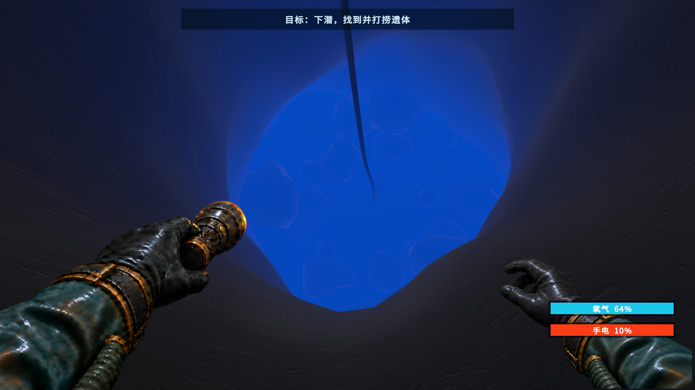
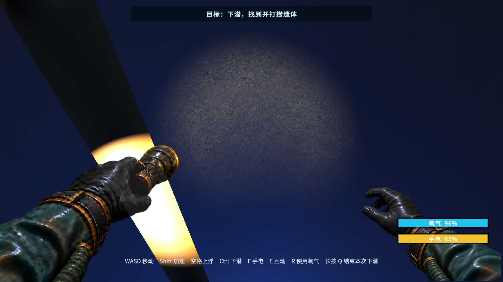
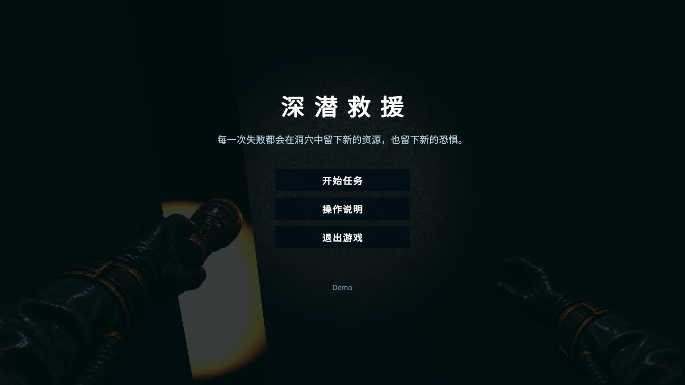

# 游戏策划作品集 | Game Design Portfolio

个人游戏策划作品集，主要展示可玩 Demo 与游戏系统拆解。

目前包含：

* Unity 独立游戏 Demo《Cave Rescue》
* 《Warframe》Mod 配卡构筑系统拆解

---

## 01｜Cave Rescue — 水下洞穴救援 Demo

**类型：** 水下探索 / 救援 / 资源管理

**开发工具：** Unity 

**职责：** 核心玩法设计、资源系统、交互逻辑、关卡搭建、Unity 实现与测试迭代。部分美术资源使用第三方/现成素材，Demo 主要用于验证玩法与系统设计。

### 游戏截图

  
  

### 核心玩法

玩家进入水下洞穴寻找救援目标，在有限资源和复杂洞穴环境下完成：

**深入探索 → 寻找目标 → 管理资源 → 完成救援 → 安全撤离**

游戏通过氧气、照明、移动效率等资源限制，让玩家在继续深入和及时撤离之间进行判断。

### 主要设计内容

* 水下探索核心循环
* 氧气与资源管理
* 救援目标与拖拽机制
* 洞穴关卡结构
* 风险 / 收益决策
* Unity 可玩 Demo 实现

### Demo 下载

**[▶ Download Cave Rescue Windows Demo](https://github.com/mochi5748/Game-Design/releases/tag/v1.0.0)**

## 02｜Warframe — Mod 配卡构筑系统拆解

**类型：** 游戏系统拆解 / Build 构筑系统分析

围绕 Warframe 的 Mod 与 Build 系统，从系统规则、构筑约束、任务适配和长期养成几个方向进行拆解。

### 拆解内容

* Mod 的属性、适用对象、极性与容量规则
* 槽位、容量和极性如何限制构筑自由
* Forma 与 Orokin 反应堆如何参与长期养成
* 不同任务目标如何产生不同 Build
* 同一战甲在不同玩法下的构筑差异
* Mod 系统如何持续制造刷取与养成目标
* 后期“Mod 很多但有效选择较少”的问题
* 将上下位替代调整为横向选择的优化思路

### 核心分析

**任务需求 → 构筑目标 → Mod 选择 → 构筑约束 → 改造优化 → 构筑成型**

通过有限槽位、容量和极性制造取舍，再利用 Forma 等养成资源逐步解除限制，使“完成目标 Build”本身成为长期成长目标。

### 系统问题与优化

后期构筑容易出现有效选择收缩：虽然 Mod 数量很多，但同一目标下往往逐渐收敛到少数高收益配置。

优化方向是减少简单的上下位数值替代，通过稳定收益、条件触发、爆发收益和风险收益等不同结构，让同一构筑目标下存在多条具有竞争力的选择。

**[📄 查看完整拆解案 PDF](./Warframe%20Mod%20Build%20System%20Analysis.pdf)**
